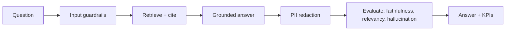
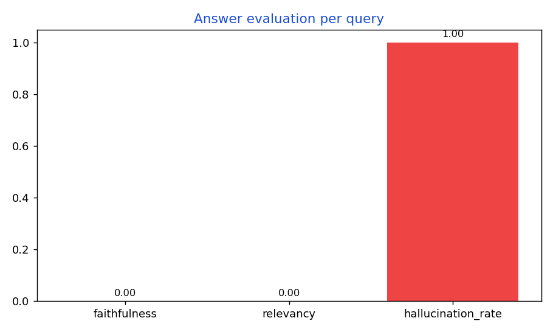

# Enterprise RAG Support Assistant

A Retrieval Augmented Generation assistant that answers customer questions from a
company knowledge base. Every answer is grounded in retrieved documents and cites
its sources, runs through input and output guardrails, and is scored by an
automated evaluation step for faithfulness, relevancy and hallucination. It also
exposes KPIs so a team can prove the assistant's value.

## Why it is useful for companies
Support teams answer the same questions thousands of times. This assistant deflects
repetitive tickets with grounded, cited answers, while the evaluation scores and
KPIs give the business confidence that answers are accurate rather than guessed.
Citations make every response auditable, which matters in regulated settings.

## What it does
- Retrieves the most relevant knowledge base documents for each question
- Generates a grounded answer that cites its sources
- Blocks prompt injection on input and redacts PII on output
- Scores every answer for faithfulness, relevancy and hallucination
- Exposes Prometheus KPIs: query volume, block rate, resolution proxy

## Architecture
```
question -> guardrails -> retrieve (cited) -> grounded answer -> evaluation -> response + KPIs
```
See docs/architecture.md.

## Quickstart
```bash
make install
make run        # serves on http://localhost:8020
```
Try it:
```bash
curl -s -X POST localhost:8020/ask -H "content-type: application/json" \
  -d '{"question":"How do I reset my password?"}' | python3 -m json.tool
```
Runs with no credentials in mock mode. Add GROQ_API_KEY in .env for real answers.
Interactive docs at http://localhost:8020/docs.

## Stack
Python, FastAPI, RAG with BM25 retrieval and citations, guardrails, automated
evaluation, Groq LLM (optional), Prometheus, Docker, GitHub Actions CI, Pytest.

## Tests
```bash
make test
```

## License
MIT

## Workflow diagram



## Sample output and charts



A runnable sample request and its real output are in [examples/sample_output.json](examples/sample_output.json).
